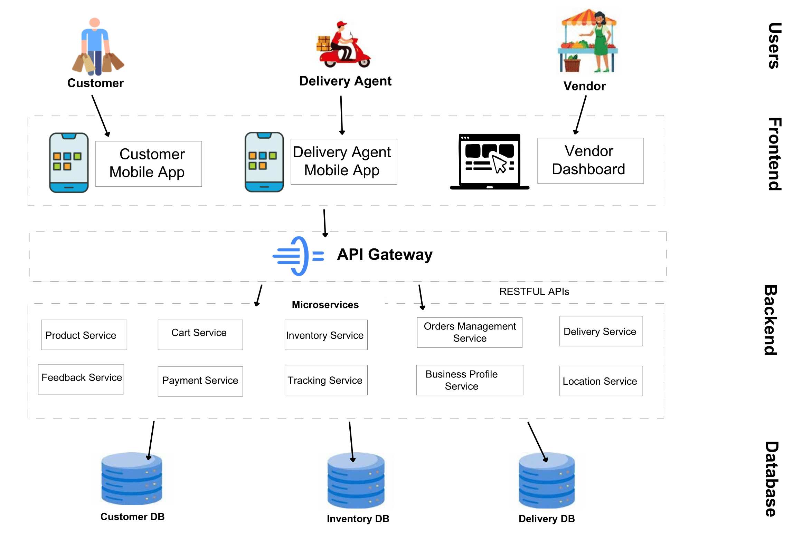
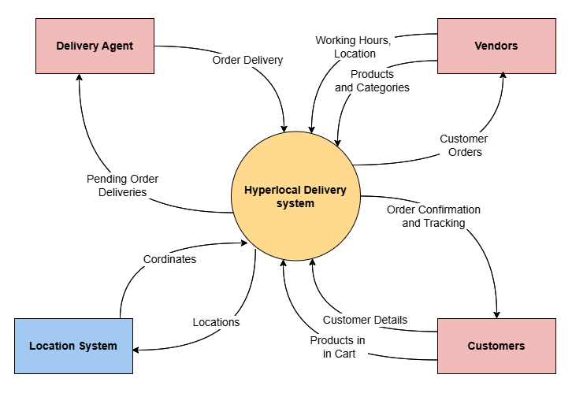

# 📦 Hyperlocal Delivery System

## Group Members
1) Syed Mohammad Kashif
2) Abdul Raheem Shahzad
3) Danish Ali
4) Juraev Dilshodbek

## Project Description
This project aims to build a `hyperlocal delivery` platform tailored for customers located within a `3-mile radius` of local shops and food vendors. The platform allows users to `browse` nearby grocery stores, restaurants, and small-scale food points, `view item details` including prices and availability, `add items` to a cart, and `place orders` for home delivery. Customers receive `live updates` on their order status—from confirmation to preparation and delivery—and can `track` the order and delivery agent’s.

To ensure quality and trust, customers are encouraged to leave `feedback and ratings` for each vendor, product, and delivery experience. This helps other users make informed decisions and motivates vendors and delivery personnel to maintain high service standards.

Vendors have access to a dedicated `dashboard` where they can manage their `inventory`, update product availability, set business hours, and view incoming orders. Delivery personnel use a mobile interface to accept `delivery requests`, navigate to destinations, and update the order status at each step.

The platform emphasizes ease of use, responsiveness, and seamless interactions among all user types. Key non-functional goals include maintaining a fast user interface, ensuring high system availability, and reliability. The user experience is designed to be intuitive and efficient, even for individuals with limited digital literacy.

Overall, this system supports the growing demand for convenient, reliable, and locally focused delivery services, fostering stronger connections between neighborhood vendors and their surrounding communities.

## Features
- **Customer Experience:**
  - Browse local vendors and food points.
  - Add items to the cart and place orders.
  - Real-time order tracking and delivery status updates.
  - Secure payment options and transaction management.
  - Ability to leave feedback and ratings for vendors, products, and delivery experiences.
  
- **Vendor Dashboard:**
  - Manage inventory and update product availability.
  - Set business hours and manage orders.
  - View and respond to customer feedback.

- **Delivery Agent Mobile Interface:**
  - Accept delivery requests and navigate to destinations.
  - Update order status at each step of the delivery process.
  
## Benefits
The platform supports the growing demand for convenient, reliable, and locally focused delivery services. It helps strengthen connections between neighborhood vendors and their surrounding communities by providing an efficient, trustworthy solution for local deliveries.

## 📄 System Overview
We included the system `Overview diagram` showing the system's end users. It shows that our system has different interfaces for end users, such as the `Customer Mobile App` for customers and the `vendor dashboard` for vendors. Then, it shows we have a common `API Gateway` for the whole system, which helps us interact with a distributed microservices backend. The system also has three main databases to store its data.

 
   
  <em> Figure 1: Architecture overview diagram showing the overview of system architecture</em>

## Stakeholder Analysis

The following are the primary stakeholders for this hyperlocal delivery platform. Each stakeholder influences the system design based on their specific needs and expectations:

- **Customers**: End-users who browse, order, and receive products. Their satisfaction directly impacts platform adoption and success. A seamless and responsive user experience is critical.
- **Vendors**: Local shops and food vendors who list products and manage inventory. Vendor participation ensures a wide variety of offerings; they require a stable and reliable system to manage daily operations.
- **Delivery Agents**: Personnel responsible for picking up and delivering orders. Their efficiency affects order fulfillment speed and customer satisfaction; they need a simple and dependable app to manage deliveries.
- **Product Owner**: Oversees the platform’s strategic direction and growth. They are concerned with building a scalable system that can support future expansions without major redesigns.
- **Developers**: Technical team responsible for developing, maintaining, and improving the platform. They prioritize clean, maintainable code to ensure long-term system health and rapid feature updates.

## Functional Requirements
| Role               | Use Case                 | Functional Requirement Description                                                                    |
| ------------------ | ------------------------ | ----------------------------------------------------------------------------------------------------- |
| **Customer**       | Browse Products          | Customers can browse a list of products offered by local vendors within the platform.                 |
| **Customer**       | Add Items to Cart        | Customers can add selected products to a shopping cart for future purchase.                           |
| **Customer**       | Place Order              | Customers can place an order from the items in their cart by confirming delivery and payment details. |
| **Customer**       | Track Order              | Customers can view real-time updates on their order status, including delivery tracking.              |
| **Customer**       | Give Feedback            | After receiving an order, customers can leave feedback or rate the product, vendor, and delivery.     |
| **Vendor**         | Setup Business Profile   | Vendors can register and configure their store with name, address, contact info, and logo.            |
| **Vendor**         | Manage Inventory         | Vendors can add, update, or delete products including availability status and pricing.                |
| **Vendor**         | Manage Orders            | Vendors can view and manage customer orders including accepting and updating order status.            |
| **Vendor**         | Respond Feedback         | Vendors can view and reply to customer feedback on their products and services.                       |
| **Delivery Agent** | Manage Delivery Requests | Delivery agents can view incoming delivery requests and choose to accept or reject them.              |
| **Delivery Agent** | Complete Order Delivery  | Delivery agents can update the status of deliveries (e.g., picked up, on the way, delivered).         |

## Quality Attributes and Key Stakeholder Concerns

| **Stakeholder**     | **Key Concerns**                                                                                         | **Relevant Quality Attributes** |
| ------------------- | -------------------------------------------------------------------------------------------------------- | ------------------------------- |
| **Customers**       | Easy-to-use app for browsing, ordering products, and receiving deliveries quickly.                       | Usability, Performance          |
| **Vendors**         | System must be highly available and consistently operational to manage inventory and orders effectively. | Availability                    |
| **Delivery Agents** | Simple, reliable app to accept deliveries and update statuses easily.                                    | Usability, Availability         |
| **Product Owner**   | The system architecture should support easy scaling  and work across multiple devices.                   | Scalability, Interoperability                    |
| **Developers**      | Codebase should be maintainable, allowing for easy updates, improvements, and issue resolution.          | Maintainability                 |

## 📄 Context Viewpoint
The `Context View` describes the `system’s boundaries` by showing its interactions with external actors such as users, vendors, delivery agents, and other systems. It highlights what is inside the system and what lies outside, helping stakeholders understand how the system fits into its environment and what major inputs and outputs exist.

The `Context Diagram` below shows how external entities, such as users and external systems, interact with our system. It shows that `vendors` provide their products and working hours information to our system, and the system provides customers with orders and business. The `customer` provides their delivery information and the products they added to the cart, and the system returns order confirmation and tracking of their orders. Similarly, the `delivery agent` receives the pending orders for delivery and completes the order delivery. Our system also interacts with external systems such as `Location API` (Google Maps) by providing the addresses and receiving the coordinates (longitude and latitude).

 
   
  <em> Figure 2: Context view of the system showing the interaction of external entities with our system</em>

## 📄 Use Case Viewpoint
The Use Case Viewpoint captures the primary ways different users (customers, vendors, and delivery agents) interact with the delivery platform to achieve their goals. It outlines the major functionalities the system must support, such as browsing vendors, placing orders, tracking deliveries, managing inventory, and updating order statuses. This viewpoint helps in understanding user requirements clearly by focusing on user-system interactions and ensures that the system is designed around real-world activities and expectations of its stakeholders.

 
   
  <em> Figure 3: Use case diagram demonstrating the use cases for vendor, customer and delivery agent</em>

## 📄 Process Viewpoint
The Process Viewpoint focuses on the system’s dynamic behavior and describes how different parts of the system interact at runtime to achieve specific tasks. It models processes such as order placement, payment handling, delivery tracking, and inventory updates, often showing how components communicate, synchronize, and handle concurrent activities. In this delivery platform, the process view ensures smooth coordination between customers, vendors, and delivery agents by managing workflows like order processing, delivery assignment, and real-time status updates.

The System Sequence Diagram (SSD) below outlines the step-by-step interactions between the key actors—Customer, Vendor, Delivery Agent—and the Hyperlocal Delivery Platform during an order's lifecycle. The process begins when the Customer browses nearby vendors, selects items, and confirms the order, prompting the System to process payment and notify the Vendor while assigning a Delivery Agent. Next, the Vendor updates inventory, confirms order acceptance, and marks it as ready for pickup, which triggers the System to alert the Delivery Agent and update the Customer on the order status. The Delivery Agent then accepts the request, picks up the order, and provides real-time updates as it moves through "En Route" to "Delivered," with the System relaying tracking information to the Customer. Finally, after delivery, the Customer submits feedback on the Vendor, products, and delivery experience, which the System records for analytics and service improvement. The diagram effectively captures the end-to-end workflow, highlighting real-time coordination, status updates, and seamless communication among all parties involved in the hyperlocal delivery process.

  
   
  <em> Figure 4: System Sequence Diagram: Order workflow between Customer, Vendor, and Delivery Agent</em>

## 📄 Development Viewpoint
The Development View focuses on the system’s internal structure from a developer’s perspective. It describes how the software is organized in the codebase — such as modules, packages, layers, and components — and how they are built and managed. This view helps developers understand how to develop, maintain, and extend the system efficiently. It also covers aspects like version control, build processes, coding standards, and team organization.

##Frontend

  
   
  <em> Figure 5: Mid-fidelity design for customer mobile application</em>

  

  
   
  <em> Figure 6: Mid-fidelity design for delivery agent mobile application</em>

  

 
   
  <em> Figure 7: Mid-fidelity design for Vendor Dashboard</em>

  

## Key Architectural Decisions to Address Quality Attributes

### 1. Usability
**Design Decisions:**
- **Component-based SPA Architecture**  
  *Why?* Provides app-like navigation without page reloads, creating smoother workflows for vendor dashboards. Components enable consistent UI patterns across the application.

*Benefit:* Faster experience - no page reloads when clicking around. Buttons and menus behave consistently everywhere.

- **Minimalist Modern Design**  
  *Why?* Reduces cognitive load through clean layouts, intuitive navigation, and adherence to current design systems. This directly improves task completion rates.

*Benefit:* Not cluttered, with clear buttons and menus. Similar to apps people already know how to use.

- **React Native for Mobile**  
  *Why?* Delivers native-like performance while maintaining a single codebase. Includes access to native gestures and animations that improve perceived responsiveness.

*Benefit:* One code works on both iPhone and Android. Feels like a normal phone app with smooth scrolling.

### 2. Performance
**Design Decisions:**
- **Microservices with REST/JSON**  
  *Why?* Enables granular scaling of high-demand services independently. JSON provides lightweight data transfer compared to alternatives like XML.

- **SQLite Local Storage**  
  *Why?* Caches frequently accessed data (e.g., product catalogs) to:  
  • Reduce API calls by 40-60%  
  • Enable offline functionality  
  • Decrease mobile data usage

*Benefit:* Remembers your recent searches and orders so it doesn't need to download them again.

- **Lazy Loading**  
  *Why?* Delays loading of non-critical resources (e.g., product images below fold) to:  
  • Improve initial page load time by ~30%  
  • Reduce server bandwidth costs

  *Benefit:* Only shows product pictures as you scroll down, so the screens load faster.

### 3. Availability
**Design Decisions:**
- **Multi-DB Deployment**  
  *Why?* Implements active-active replication to:  
  • Survive regional outages  
  • Maintain 99.95% uptime  
  • Distribute read queries

*Benefit:* If one database stops working, another can take over immediately.

- **Microservices Isolation**  
  *Why?* Contains failures to individual services - a payment service outage won't take down product catalog.
  
  *Benefit:* If payments stop working, you can still browse products.
  
### 4. Scalability
**Design Decisions:**
- **Horizontal Microservices Scaling**  
  *Why?* Allows adding instances of only the services under load (e.g., scaling order processing separately from user profiles).

- **Stateless APIs**  
  *Why?* Enables instant scaling without session affinity requirements. Simplifies load balancing.

  *Benefit:* No server-side session storage is required, making adding more servers (horizontal scaling) easy. Requests can be routed to any available instance.

### 5. Maintainability
**Design Decisions:**
- **MVC with ORM**  
  *Why?* Provides:  
  • Clear separation between business logic and presentation  
  • Automated SQL generation, reducing boilerplate code  
  • Schema version control via migrations

  *Benefit:* Keeps code organized like separate folders for different tasks.

- **React Native Unified Codebase**  
  *Why?* Reduces mobile maintenance overhead by:  
  • Sharing 85%+ code between iOS/Android  
  • Enabling single CI/CD pipeline
  
  *Benefit:* Fix a bug once and it's fixed on both iPhone and Android.

## Architecture Trade-offs

| Quality Attribute | Decision          | Trade-off                          |
|-------------------|-------------------|------------------------------------|
| Scalability       | Microservices     | Higher operational complexity      |
| Availability      | Multiple DBs      | Increased infrastructure cost      |
| Maintainability   | MVC, ORM          | Slight performance overhead       |
| Mobile Apps       | React Native      | Limited native performance         |
| Performance       | SQLite            | Storage overhead on devices        |
| API Design        | REST APIs (JSON)       | Less real-time than WebSockets     |

## 📜 History Log

| Date           | Task Description                                                                                 | Contributor                  |
|----------------|--------------------------------------------------------------------------------------------------|------------------------------|
| 2025, April 6  | Discussion and selection of project ideas for MSA course project.                                | Syed, Danish, Shahzad, Juraev|
| 2025, April 6  | Finalized the idea of a hyperlocal delivery platform and created the GitHub repository.          | Syed, Danish, Shahzad, Juraev|
| 2025, April 6  | Drafted 150-word and 250-word project descriptions for GitHub and course use.                    | Syed, Danish, Shahzad, Juraev|
| 2025, April 15 | Created system overview diagram and written explanation of the system architecture.              | Syed, Shahzad                |
| 2025, April 15 | Stakeholder analysis and identifying stakeholders' key concerns (quality attributes)             | Syed, Danish, Shahzad        |
| 2025, April 15 | Writing of functional requirements and quality attributes.                                       | Syed, Danish, Juraev         |
| 2025, May 05   | Created Use case diagram and context diagram to provide the use case view of the architecture.  | Syed, Danish, Shahzad, Juraev |
| 2025, May 05   | Created the system sequence diagram to show the process view of the system.                     | Syed, Shahzad                 |
| 2025, May 07   | Created the mid-fidelity design of the system to show the usability view of the system.         | Syed, Danish|
| 2025, May 07 | Listed the key architecture decisions, how it addresses the quality attributes and potential trade-offs. | Syed, Danish, Shahzad, Juraev|

