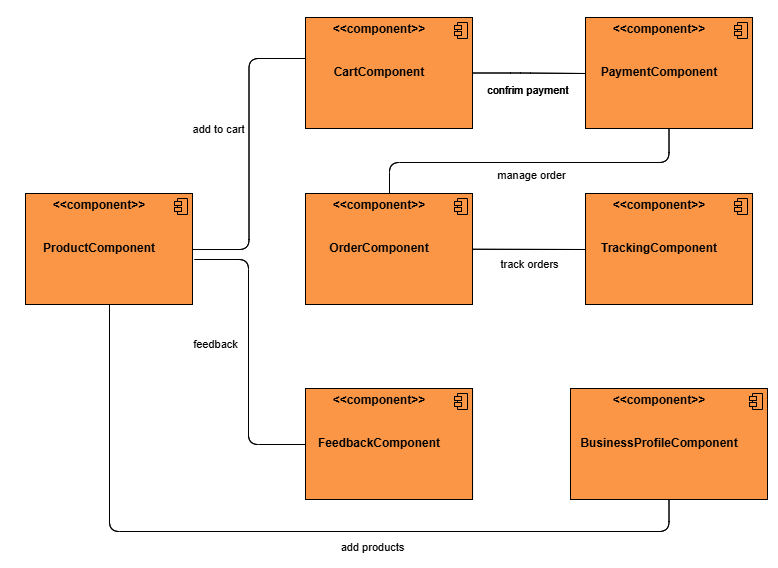

## Table of Contents
1. [Project Description](#project-description)
2. [Features](#features)
3. [System Overview](#system-overview)
4. [Stakeholder Analysis](#stakeholder-analysis)
5. [Functional Requirements](#functional-requirements)
   - 5.1 [Customer Requirements](#customer-requirements)
   - 5.2 [Vendor Requirements](#vendor-requirements)
   - 5.3 [Delivery Agent Requirements](#delivery-agent-requirements)
6. [Quality Attributes](#quality-attributes-and-key-stakeholder-concerns)
7. [Architectural Views](#architectural-views)
   - 7.1 [Context Viewpoint](#context-viewpoint)
   - 7.2 [Use Case Viewpoint](#use-case-viewpoint)
   - 7.3 [Process Viewpoint](#process-viewpoint)
   - 7.4 [Development Viewpoint](#development-viewpoint)
8. [Microservices Architecture](#microservices-architecture)
9. [Key Architectural Decisions](#key-architectural-decisions-to-address-quality-attributes)
10. [Architectural Trade-offs](#architectural-decisions--trade-offs)
11. [Revision History](#history-log)
12. Figures
    - 12.1 [Figure 1: System Overview](#figure-1-architecture-overview-diagram-showing-the-overview-of-system-architecture)
    - 12.2 [Figure 2: Context Diagram](#figure-2-context-view-of-the-system-showing-the-interaction-of-external-entities-with-our-system)
    - 12.3 [Figure 3: Use Case Diagram](#figure-3-use-case-diagram-demonstrating-the-use-cases-for-vendor-customer-and-delivery-agent)
    - 12.4 [Figure 4: Sequence Diagram](#figure-4-system-sequence-diagram-to-show-interaction-between-customer-vendor-and-delivery-agent)
    - 12.5 [Figure 5: Component Diagram](#figure-5-component-view-of-hyperlocal-delivery-system)
    - 12.6 [Figure 6: Customer UI](#figure-6-mid-fidelity-design-for-customer-mobile-application)
    - 12.7 [Figure 7: Agent UI](#figure-7-mid-fidelity-design-for-delivery-agent-mobile-application)
    - 12.8 [Figure 8: Vendor Dashboard](#figure-8-mid-fidelity-design-for-vendor-dashboard)
    - 12.9 [Figure 9: Microservices](#figure-9-mircoservices-architecture-style-of-hyperlocal-delivery-system)

## Group Members
1) Syed Mohammad Kashif
2) Abdul Raheem Shahzad
3) Danish Ali
4) Juraev Dilshodbek
   

## Project Description
This project aims to build a `hyperlocal delivery` platform tailored for customers located within a `3-mile radius` of local shops and food vendors. The platform allows users to `browse` nearby grocery stores, restaurants, and small-scale food points, `view item details` including prices and availability, `add items` to a cart, and `place orders` for home delivery. Customers receive `live updates` on their order status—from confirmation to preparation and delivery—and can `track` the order and delivery agent’s.

To ensure quality and trust, customers are encouraged to leave `feedback and ratings` for each vendor, product, and delivery experience. This helps other users make informed decisions and motivates vendors and delivery personnel to maintain high service standards.

Vendors have access to a dedicated `dashboard` where they can manage their `inventory`, update product availability, set business hours, and view incoming orders. Delivery personnel use a mobile interface to accept `delivery requests`, navigate to destinations, and update the order status at each step.

The platform emphasizes ease of use, responsiveness, and seamless interactions among all user types. Key non-functional goals include maintaining a fast user interface, ensuring high system availability, and reliability. The user experience is designed to be intuitive and efficient, even for individuals with limited digital literacy.

Overall, this system supports the growing demand for convenient, reliable, and locally focused delivery services, fostering stronger connections between neighborhood vendors and their surrounding communities.

## Features
- **Customer Experience:**
  - Browse local vendors and food points.
  - Add items to the cart and place orders.
  - Real-time order tracking and delivery status updates.
  - Secure payment options and transaction management.
  - Ability to leave feedback and ratings for vendors, products, and delivery experiences.
  
- **Vendor Dashboard:**
  - Manage inventory and update product availability.
  - Set business hours and manage orders.
  - View and respond to customer feedback.

- **Delivery Agent Mobile Interface:**
  - Accept delivery requests and navigate to destinations.
  - Update order status at each step of the delivery process.
  
## Benefits
The platform supports the growing demand for convenient, reliable, and locally focused delivery services. It helps strengthen connections between neighborhood vendors and their surrounding communities by providing an efficient, trustworthy solution for local deliveries.

## 📄 System Overview
We included the system `Overview diagram` showing the system's end users. It shows that our system has different interfaces for end users, such as the `Customer Mobile App` for customers and the `vendor dashboard` for vendors. Then, it shows we have a common `API Gateway` for the whole system, which helps us interact with a distributed microservices backend. The system also has three main databases to store its data.

 
   
  <em> Figure 1: Architecture overview diagram showing the overview of system architecture</em>

## Stakeholder Analysis

The following are the primary stakeholders for this hyperlocal delivery platform. Each stakeholder influences the system design based on their specific needs and expectations:

- **Customers**: End-users who browse, order, and receive products. Their satisfaction directly impacts platform adoption and success. A seamless and responsive user experience is critical.
- **Vendors**: Local shops and food vendors who list products and manage inventory. Vendor participation ensures a wide variety of offerings; they require a stable and reliable system to manage daily operations.
- **Delivery Agents**: Personnel responsible for picking up and delivering orders. Their efficiency affects order fulfillment speed and customer satisfaction; they need a simple and dependable app to manage deliveries.
- **Product Owner**: Oversees the platform’s strategic direction and growth. They are concerned with building a scalable system that can support future expansions without major redesigns.
- **Developers**: Technical team responsible for developing, maintaining, and improving the platform. They prioritize clean, maintainable code to ensure long-term system health and rapid feature updates.

## Functional Requirements

### Customer Requirements
**CUS-1 Add Items to Cart**  
- The customer shall be able to add items to cart  
- The customer shall be able to remove items from cart  
- The customer shall be able to view cart contents  
- The customer shall be able to see real-time price total  

**CUS-2 Place Order**  
- The customer shall be able to initiate checkout  
- The customer shall be able to select delivery address  
- The customer shall be able to choose payment method  
- The customer shall be able to confirm order  

**CUS-3 Track Order**  
- The customer shall be able to view order status  
- The customer shall be able to see delivery agent location  
- The customer shall be able to contact delivery agent  
- The customer shall be able to mark delivery as received  

**CUS-4 Give Feedback**  
- The customer shall be able to rate products (1-5 stars)  
- The customer shall be able to write text reviews  
- The customer shall be able to submit feedback anonymously  
- The customer shall be able to edit feedback within 24 hours  

### Vendor Requirements
**VEN-1 Setup Business Profile**  
- The vendor shall be able to register store information  
- The vendor shall be able to upload the business logo  
- The vendor shall be able to set service areas  
- The vendor shall be able to configure business hours  

**VEN-2 Manage Inventory**  
- The vendor shall be able to add new products  
- The vendor shall be able to update product details  
- The vendor shall be able to mark items as out of stock  
- The vendor shall be able to set product prices  

**VEN-3 Manage Orders**  
- The vendor shall be able to view new orders  
- The vendor shall be able to accept/reject orders  
- The vendor shall be able to update the order status  
- The vendor shall be able to cancel orders  

**VEN-4 Respond Feedback**  
- The vendor shall be able to view customer ratings  
- The vendor shall be able to reply to reviews  
- The vendor shall be able to report inappropriate feedback  
- The vendor shall be able to view feedback analytics  

### Delivery Agent Requirements
**DEL-1 Manage Delivery Requests**  
- The agent shall be able to view assigned deliveries  
- The agent shall be able to accept/reject delivery requests  
- The agent shall be able to see delivery locations on the map  
- The agent shall be able to view package details  

**DEL-2 Complete Order Delivery**  
- The agent shall be able to mark orders as picked up  
- The agent shall be able to update the delivery status  
- The agent shall be able to collect customer signatures  
- The agent shall be able to mark orders as delivered  

## Quality Attributes and Key Stakeholder Concerns

| **Stakeholder**     | **Key Concerns**                                                                                         | **Relevant Quality Attributes** |
| ------------------- | -------------------------------------------------------------------------------------------------------- | ------------------------------- |
| **Customers**       | Easy-to-use app for browsing, ordering products, and receiving deliveries quickly.                       | Usability, Performance          |
| **Vendors**         | System must be highly available and consistently operational to manage inventory and orders effectively. | Availability                    |
| **Delivery Agents** | Simple, reliable app to accept deliveries and update statuses easily.                                    | Usability, Availability         |
| **Product Owner**   | The system architecture should support easy scaling  and work across multiple devices.                   | Scalability, Interoperability                    |
| **Developers**      | Codebase should be maintainable, allowing for easy updates, improvements, and issue resolution.          | Maintainability                 |

## Architectural Views
### Context Viewpoint
The `Context View` describes the `system’s boundaries` by showing its interactions with external actors such as users, vendors, delivery agents, and other systems. It highlights what is inside the system and what lies outside, helping stakeholders understand how the system fits into its environment and what major inputs and outputs exist.

The `Context Diagram` below shows how external entities, such as users and external systems, interact with our system. It shows that `vendors` provide their products and working hours information to our system, and the system provides customers with orders and business. The `customer` provides their delivery information and the products they added to the cart, and the system returns order confirmation and tracking of their orders. Similarly, the `delivery agent` receives the pending orders for delivery and completes the order delivery. Our system also interacts with external systems such as `Location API` (Google Maps) by providing the addresses and receiving the coordinates (longitude and latitude).

 
   
  <em> Figure 2: Context view of the system showing the interaction of external entities with our system</em>

### Use Case Viewpoint
The Use Case Viewpoint captures the primary ways different users (customers, vendors, and delivery agents) interact with the delivery platform to achieve their goals. It outlines the major functionalities the system must support, such as browsing vendors, placing orders, tracking deliveries, managing inventory, and updating order statuses. This viewpoint helps in understanding user requirements clearly by focusing on user-system interactions and ensures that the system is designed around real-world activities and expectations of its stakeholders.

 
   
  <em> Figure 3: Use case diagram demonstrating the use cases for vendor, customer and delivery agent</em>

### Process Viewpoint
The Process Viewpoint focuses on the system’s dynamic behavior and describes how different parts of the system interact at runtime to achieve specific tasks. It models processes such as order placement, payment handling, delivery tracking, and inventory updates, often showing how components communicate, synchronize, and handle concurrent activities. In this delivery platform, the process view ensures smooth coordination between customers, vendors, and delivery agents by managing workflows like order processing, delivery assignment, and real-time status updates.

The System Sequence Diagram (SSD) below outlines the step-by-step interactions between the key actors—Customer, Vendor, Delivery Agent—and the Hyperlocal Delivery Platform during an order's lifecycle. The process begins when the Customer browses nearby vendors, selects items, and confirms the order, prompting the System to process payment and notify the Vendor while assigning a Delivery Agent. Next, the Vendor updates inventory, confirms order acceptance, and marks it as ready for pickup, which triggers the System to alert the Delivery Agent and update the Customer on the order status. The Delivery Agent then accepts the request, picks up the order, and provides real-time updates as it moves through "En Route" to "Delivered," with the System relaying tracking information to the Customer. Finally, after delivery, the Customer submits feedback on the Vendor, products, and delivery experience, which the System records for analytics and service improvement. The diagram effectively captures the end-to-end workflow, highlighting real-time coordination, status updates, and seamless communication among all parties involved in the hyperlocal delivery process.

  
   
  <em> Figure 4: System Sequence Diagram to show interaction between Customer, Vendor, and Delivery Agent</em>

### Development Viewpoint
The Development View focuses on the system’s internal structure from a developer’s perspective. It describes how the software is organized in the codebase — such as modules, packages, layers, and components — and how they are built and managed. This view helps developers understand how to develop, maintain, and extend the system efficiently. It also covers aspects like version control, build processes, coding standards, and team organization.

  
   
  <em> Figure 5: Component view of hyperlocal delivery system</em>

### Architectural Component Descriptions

**ProductComponent**  
The `ProductComponent` manages the product catalog and inventory, ensuring accurate stock levels and product details are available. It serves as the source of truth for product data, which other components like `CartComponent` and `OrderComponent` rely on to display items and validate availability during checkout.

**CartComponent**  
The `CartComponent` handles all cart-related operations, such as adding or removing items, calculating totals, and applying discounts. It interacts with the `ProductComponent` to fetch real-time product details and passes finalized carts to the `OrderComponent` to initiate the checkout process.

**OrderComponent**  
The `OrderComponent` oversees the entire order lifecycle, from creation to confirmation or cancellation. It coordinates with the `CartComponent` to process items, triggers the `PaymentComponent` for transactions, and notifies the `TrackingComponent` to monitor order status post-purchase.

**PaymentComponent**  
The `PaymentComponent` manages all payment processing, including credit card transactions, digital wallets, and refunds. It ensures secure payment authorization and communicates success or failure back to the `OrderComponent`, which then updates the order status accordingly.

**TrackingComponent**  
The `TrackingComponent` monitors order fulfillment, providing real-time shipping and delivery status updates. It receives order data from the `OrderComponent`, tracks and delivers products, and notifies customers of progress.

**FeedbackComponent**  
The `FeedbackComponent` collects and processes customer reviews and ratings linked to orders. It aggregates feedback for analytics, which the `BusinessProfileComponent` uses to generate vendor performance reports and improve service quality.

**BusinessProfileComponent**  
The `BusinessProfileComponent` manages vendor profiles, store settings, and business analytics. It compiles data from orders, payments, and feedback to provide insights into sales performance, customer satisfaction, and operational efficiency.

### Usability and Interoperability
We provided the mid-fidelity designs to address the end users' usability concerns and demonstrate how our system is built to work on different platforms such as IOs, Android and Web, demonstrating the interoperability of our system. This will help us demonstrate our key architectural decisions for improved user experience.

  
   
  <em> Figure 6: Mid-fidelity design for customer mobile application</em>

  
   
  <em> Figure 7: Mid-fidelity design for delivery agent mobile application</em>

 
   
  <em> Figure 8: Mid-fidelity design for Vendor Dashboard</em>

## Architectural Patterns Used in the Project
### Microservices Architecture 
Our system follows the mircoservices architecture style in comparison to monolithic architecture, and we have total 7 mircoservices. The three clients: 1) Customer mobile app 2) Vendor dashboard 3) Delivery agent mobile app, interacts with the backend microservices through an API gateway. This interaction is stateless using RESTful APIs and the communication between these microservices and the clients are through JSON data format. The below diagram show the mircoservices architecture style of our system.

 
   
  <em> Figure 9: Mircoservices architecture style of Hyperlocal delivery system</em>

### Model-View-Controller (MVC) Pattern

### RESTful API Pattern

## Key Architectural Decisions to Address Quality Attributes

### 1. Usability

#### Component-based SPA Architecture
- **Issue**: Traditional multi-page applications cause reloads that interrupt workflows.
- **Rationale**: Single Page Applications (SPA) provide seamless navigation and faster interactions, crucial for vendor dashboards. Component-based design ensures consistency and reusability across the app.
- **Benefits**: Smooth user experience with no full-page reloads; consistent design language throughout the app.
- **Limitations**: Requires more complex client-side state management (e.g., Redux) and might affect initial load time.
- **Alternative Solutions**: Use server-side rendering (SSR) frameworks like **Next.js** to balance performance and interactivity.  
  > _We chose SPA with React for its seamless UX and performance. SSR was considered but offers less client-side interactivity._

#### Minimalist Modern Design
- **Issue**: Overly complex UI designs increase cognitive load, reducing task efficiency.
- **Rationale**: Minimalist design simplifies navigation and enhances usability by reducing visual clutter.
- **Benefits**: Users can complete tasks faster due to intuitive layouts and familiar interaction patterns.
- **Limitations**: Risk of oversimplifying features or omitting necessary visual cues.
- **Alternative Solutions**: Employ **user-centered design (UCD)** or participatory design to balance simplicity and features.  
  > _Minimalist design was preferred for its clarity; UCD was considered but adds complexity in rapid delivery._

#### React Native for Mobile
- **Issue**: Building separate native apps for iOS and Android increases development and maintenance costs.
- **Rationale**: React Native provides near-native performance with a shared codebase, reducing costs and improving delivery speed.
- **Benefits**: Consistent behavior across platforms, reduced development effort, access to native gestures and animations.
- **Limitations**: May encounter limitations in accessing low-level native APIs; requires bridging in some cases.
- **Alternative Solutions**: Use **Flutter** for high-performance cross-platform development or native development for full control.  
  > _React Native chosen for its balance of cost, performance, and developer familiarity; Flutter or native could add overhead._

### 2. Performance

#### Microservices with REST/JSON
- **Issue**: Monolithic architectures limit scalability and can become performance bottlenecks.
- **Rationale**: Microservices allow scaling of individual components, and REST/JSON offers lightweight communication.
- **Benefits**: Independent scaling, improved fault isolation, reduced data transfer size.
- **Limitations**: Increased complexity in managing service boundaries and deployments.
- **Alternative Solutions**: Use **GraphQL** to optimize API communication or **gRPC** for higher performance.  
  > _REST/JSON was selected for simplicity and wide compatibility; GraphQL or gRPC were considered but are heavier solutions._

#### SQLite Local Storage
- **Issue**: Frequent API calls for product data increase load times and data usage.
- **Rationale**: Local storage caches frequently accessed data, reducing API calls and enabling offline access.
- **Benefits**: Improved load times, reduced mobile data usage, offline functionality.
- **Limitations**: Risk of stale data if synchronization is not managed properly.
- **Alternative Solutions**: Use **IndexedDB (for web)** or **Realm DB (for mobile)** for more advanced local data management.  
  > _SQLite was chosen for simplicity; IndexedDB or Realm offer more features but add complexity._

#### Kubernetes Orchestration
- **Issue**: High-availability requirements for backend services under dynamic loads.
- **Rationale**: Kubernetes provides automated deployment, scaling, and self-healing capabilities.
- **Benefits**: High availability, automatic scaling, fault tolerance, and load balancing.
- **Limitations**: Steep learning curve, additional overhead for managing Kubernetes clusters.
- **Alternative Solutions**: Use **serverless architectures** (e.g., AWS Lambda) or **Docker Swarm**.  
  > _Kubernetes was chosen for robust orchestration; simpler alternatives were considered but lacked required capabilities._

#### Lazy Loading
- **Issue**: Loading all resources upfront increases initial page load time.
- **Rationale**: Lazy loading defers non-critical resources, improving perceived performance.
- **Benefits**: Faster initial page loads, reduced server bandwidth.
- **Limitations**: Possible delays in loading deferred resources when needed.
- **Alternative Solutions**: Implement **critical CSS** and prioritized loading, or use **CDN edge caching**.  
  > _Lazy loading provides direct benefits with minimal complexity; CDN strategies are good but secondary._

### 3. Availability

#### Multi-DB Deployment
- **Issue**: Single database failure can cause downtime.
- **Rationale**: Active-active replication distributes load and ensures failover capabilities.
- **Benefits**: High availability, resilience to regional failures, and distributed reads.
- **Limitations**: Increased complexity in replication and consistency management.
- **Alternative Solutions**: Use managed distributed databases like **Amazon Aurora Global** or **Google Cloud Spanner**.  
  > _Multi-DB replication was chosen for control and resilience; managed solutions were considered but add vendor lock-in._

#### Microservices Isolation
- **Issue**: Failures in one part of the system can cascade and affect the entire system.
- **Rationale**: Isolating services ensures faults remain contained.
- **Benefits**: One service failure (e.g., payments) does not affect others (e.g., product catalog).
- **Limitations**: Requires robust inter-service communication and monitoring.
- **Alternative Solutions**: Use **modular monolith** or **Domain-Driven Design (DDD)**.  
  > _Service isolation chosen for clear fault boundaries; modular monolith is simpler but less scalable._

### 4. Scalability

#### Horizontal Microservices Scaling
- **Issue**: Sudden increases in load can overwhelm services.
- **Rationale**: Horizontal scaling adds instances of services under load.
- **Benefits**: Scalability with predictable performance.
- **Limitations**: Requires effective load balancing and monitoring.
- **Alternative Solutions**: Use **serverless functions** for automatic scaling without managing infrastructure.  
  > _Horizontal scaling offers predictable control; serverless functions were considered but have cold start penalties._

#### Stateless APIs
- **Issue**: Stateful APIs complicate scaling due to session management.
- **Rationale**: Stateless APIs simplify scaling and load balancing by removing session dependency.
- **Benefits**: Easy horizontal scaling, reduced complexity.
- **Limitations**: Requires external session management (e.g., Redis) if needed.
- **Alternative Solutions**: Use **sticky sessions**.  
  > _Stateless APIs chosen for their simplicity; sticky sessions add operational considerations._

### 5. Maintainability

#### MVC with ORM
- **Issue**: Coupled business logic and presentation layers increase complexity and maintenance costs.
- **Rationale**: MVC separates concerns, and ORM reduces boilerplate while managing database interactions.
- **Benefits**: Clean code structure, reduced development overhead, version-controlled schema changes.
- **Limitations**: ORM can introduce performance overhead for complex queries.
- **Alternative Solutions**: Use **micro-ORMs like Dapper** or raw SQL for performance-critical parts.  
  > _MVC with ORM was chosen for its maintainability; micro-ORMs/raw SQL are alternatives but increase manual work._

#### React Native Unified Codebase
- **Issue**: Maintaining separate iOS and Android codebases leads to duplication of work.
- **Rationale**: React Native allows sharing most of the code, reducing maintenance and delivery effort.
- **Benefits**: Single codebase, faster bug fixes, unified CI/CD pipeline.
- **Limitations**: Limited access to certain native modules, may need custom bridging.
- **Alternative Solutions**: Use **Flutter** for even more unified code or **native development** for full control.  
  > _React Native chosen for simplicity and shared code; Flutter and native were considered but add complexity._

## History Log

| Date           | Task Description                                                                                 | Contributor                  |
|----------------|--------------------------------------------------------------------------------------------------|------------------------------|
| 2025, April 6  | Discussion and selection of project ideas for MSA course project.                                | Syed, Danish, Shahzad, Juraev|
| 2025, April 6  | Finalized the idea of a hyperlocal delivery platform and created the GitHub repository.          | Syed, Danish, Shahzad, Juraev|
| 2025, April 6  | Drafted 150-word and 250-word project descriptions for GitHub and course use.                    | Syed, Danish, Shahzad, Juraev|
| 2025, April 15 | Created system overview diagram and written explanation of the system architecture.              | Syed, Shahzad                |
| 2025, April 15 | Stakeholder analysis and identifying stakeholders' key concerns (quality attributes)             | Syed, Danish, Shahzad        |
| 2025, April 15 | Writing of functional requirements and quality attributes.                                       | Syed, Danish, Juraev         |
| 2025, May 05   | Created Use case diagram and context diagram to provide the use case view of the architecture.  | Syed, Danish, Shahzad, Juraev |
| 2025, May 05   | Created the system sequence diagram to show the process view of the system.                     | Syed, Shahzad                 |
| 2025, May 07   | Created the mid-fidelity design of the system to show the usability view of the system.         | Syed, Danish|
| 2025, May 07 | Listed the key architecture decisions, how it addresses the quality attributes and potential trade-offs. | Syed, Danish, Shahzad, Juraev|

