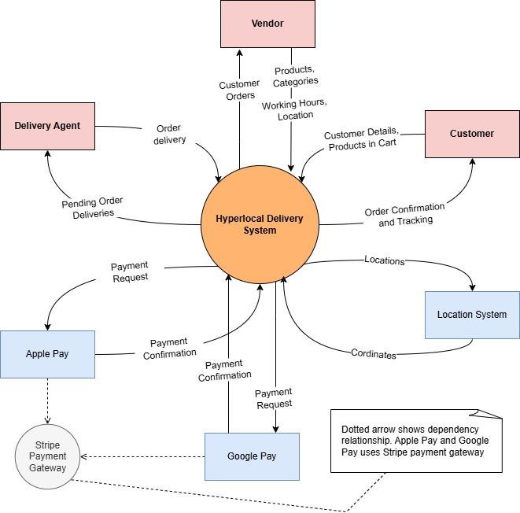
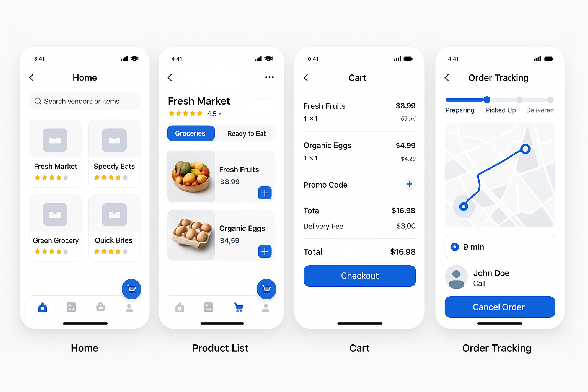

## Table of Contents

1. [Project Description](#1-project-description)
2. [Features](#2-features)
3. [System Overview](#3-system-overview)
4. [Stakeholder Analysis](#4-stakeholder-analysis)
5. [Functional Requirements](#5-functional-requirements)
   - 5.1 [Customer Requirements](#5.1-customer-requirements)
   - 5.2 [Vendor Requirements](#5-2-vendor-requirements)
   - 5.3 [Delivery Agent Requirements](#5-3-delivery-agent-requirements)
6. [Quality Attributes](#6-quality-attributes-and-key-stakeholder-concerns)
7. [Architectural Views](#7-architectural-views)
   - 7.1 [Context Viewpoint](#7-1-context-viewpoint)
   - 7.2 [Use Case Viewpoint](#7-2-use-case-viewpoint)
   - 7.3 [Process Viewpoint](#7-3-process-viewpoint)
   - 7.4 [Development Viewpoint](#7-4-development-viewpoint)
8. [Usability](#8-usability)
9. [Architectural Patterns Used in the Project](#9-architectural-patterns-used-in-the-project)
   - 9.1 [Microservices Architecture](#9-1-microservices-architecture)
   - 9.2 [Model-View-Controller (MVC) Pattern](#9-2-model-view-controller-mvc-pattern)
   - 9.3 [RESTful API Pattern](#9-3-restful-api-pattern)
10. [Key Architectural Decisions](#10-key-architectural-decisions-to-address-quality-attributes)
   - 10.1  [Component-based SPA Architecture](#10-1-component-based-spa-architecture)  
   - 10.2  [Minimalist Modern Design](#10-2-minimalist-modern-design)  
   - 10.3  [React Native for Mobile](#10-3-react-native-for-mobile)  
   - 10.4  [Microservices with REST/JSON](#10-4-microservices-with-rest-json)  
   - 10.5  [SQLite Local Storage](#10-5-sqlite-local-storage)  
   - 10.6  [Kubernetes Orchestration](#10-6-kubernetes-orchestration)  
   - 10.7  [Lazy Loading](#10-7-lazy-loading)  
   - 10.8  [Multi-DB Deployment](#10-8-multi-db-deployment)  
   - 10.9  [Microservices Isolation](#10-9-microservices-isolation)  
   - 10.10  [Horizontal Microservices Scaling](#10-10-horizontal-microservices-scaling)  
   - 10.11  [Stateless APIs](#10-11-stateless-apis)  
   - 10.12  [MVC with ORM](#10-12-mvc-with-orm)  
   - 10.13  [React Native Unified Codebase](#10-13-react-native-unified-codebase)

11. [Architectural decisions relationships](#11-architectural-decisions--trade-offs)
12. [References](#12-References)
13. [Revision History](#12-history-log)
14. [Figures](#13-figures)
    - 13.1 [Figure 1: System Overview](#figure-1-architecture-overview-diagram-showing-the-overview-of-system-architecture)
    - 13.2 [Figure 2: Context Diagram](#figure-2-context-view-of-the-system-showing-the-interaction-of-external-entities-with-our-system)
    - 13.3 [Figure 3: Use Case Diagram](#figure-3-use-case-diagram-demonstrating-the-use-cases-for-vendor-customer-and-delivery-agent)
    - 13.4 [Figure 4: Sequence Diagram](#figure-4-system-sequence-diagram-to-show-interaction-between-customer-vendor-and-delivery-agent)
    - 13.5 [Figure 5: Component Diagram](#figure-5-component-view-of-hyperlocal-delivery-system)
    - 13.6 [Figure 6: Customer UI](#figure-6-mid-fidelity-design-for-customer-mobile-application)
    - 13.7 [Figure 7: Agent UI](#figure-7-mid-fidelity-design-for-delivery-agent-mobile-application)
    - 13.8 [Figure 8: Vendor Dashboard](#figure-8-mid-fidelity-design-for-vendor-dashboard)
    - 13.9 [Figure 9: Microservices](#figure-9-mircoservices-architecture-style-of-hyperlocal-delivery-system)
    - 13.10 [Figure 10: MVC Pattern](#figure-10-mvc-pattern-of-hyperlocal-delivery-system)
    - 13.11 [Figure 11: RESTful API](#figure-11-rest-pattern-of-hyperlocal-delivery-system)
    - 13.12 [Figure 12: Key Architectural Decisions](#figure-8-relationship)

## Group Members
1) Syed Mohammad Kashif
2) Abdul Raheem Shahzad
3) Danish Ali
4) Juraev Dilshodbek
   

## 1. Project Description
This project aims to build a `hyperlocal delivery` platform tailored for customers located within a `3-mile radius` of local shops and food vendors. The platform allows users to `browse` nearby grocery stores, restaurants, and small-scale food points, `view item details` including prices and availability, `add items` to a cart, and `place orders` for home delivery. Customers receive `live updates` on their order status—from confirmation to preparation and delivery—and can `track` the order and delivery agent’s.

To ensure quality and trust, customers are encouraged to leave `feedback and ratings` for each vendor, product, and delivery experience. This helps other users make informed decisions and motivates vendors and delivery personnel to maintain high service standards.

Vendors have access to a dedicated `dashboard` where they can manage their `inventory`, update product availability, set business hours, and view incoming orders. Delivery agents use a mobile interface to accept `delivery requests`, navigate to destinations, and update the order status at each step.

The platform emphasizes ease of use, responsiveness, and seamless interactions among all user types. Key non-functional goals include maintaining a fast user interface, ensuring high system availability, and reliability. The user experience is designed to be intuitive and efficient, even for individuals with limited digital literacy.

Overall, this system supports the growing demand for convenient, reliable, and locally focused delivery services, fostering stronger connections between neighborhood vendors and their surrounding communities.

## 2. Features
- **Customer Mobile Interface:**
  - Browse local vendors and food points.
  - Add items to the cart and place orders.
  - Real-time order tracking and delivery status updates.
  - Secure payment options and transaction management.
  - Ability to leave feedback and ratings for vendors, products, and delivery experiences.
  
- **Vendor Dashboard:**
  - Manage inventory and update product availability.
  - Set up a business profile and business hours.
  - Manage orders.
  - View and respond to customer feedback.

- **Delivery Agent Mobile Interface:**
  - Accept delivery requests and navigate to destinations.
  - Update order status at each step of the delivery process.
  
## Benefits
The platform supports the growing demand for convenient, reliable, and locally focused delivery services. It helps strengthen connections between neighborhood vendors and their surrounding communities by providing an efficient, trustworthy solution for local deliveries.

## 3. System Overview
We included the system's `Overview diagram` showing the system's end users. It shows that our system has different interfaces for end users, such as the `Customer Mobile App` for customers and the `vendor dashboard` for vendors. Then, it shows we have a common `API Gateway` for the whole system, allowing us to have a single point of entry to the system. It helps us interact with a distributed microservices backend. The system uses RESTful APIs for communication, enabling stateless and efficient data communication between the front and backend. The system also has three central databases to store its data. 

 
   
  <em> Figure 1: Architecture overview diagram showing the overview of system architecture</em>

## 4. Stakeholder Analysis

The following are the primary stakeholders for this hyperlocal delivery platform. Each stakeholder influences the system design based on their specific needs and expectations:

### Stakeholders
- **Customers**: End-users who browse, order, and receive products. Their satisfaction directly impacts platform adoption and success. A seamless and responsive user experience is critical.
  
- **Vendors**: Local shops and food vendors who list products and manage inventory. Vendor participation ensures a wide variety of offerings; they require a stable and reliable system to manage daily operations.
  
- **Delivery Agents**: Personnel responsible for picking up and delivering orders. Their efficiency affects order fulfillment speed and customer satisfaction; they need a simple and dependable app to manage deliveries.
  
- **Product Owner**: Oversees the platform’s strategic direction and growth. They are concerned with building a scalable system that can support future expansions without major redesigns.

- **Developers**: Technical team responsible for developing, maintaining, and improving the platform. They prioritize clean, maintainable code to ensure long-term system health and rapid feature updates.

### Negative Stakeholders  
While our hyperlocal delivery platform provides value to customers, vendors, and delivery agents, certain stakeholders may oppose or be negatively impacted by the system. Identifying these groups helps mitigate risks and ensures smoother adoption.  

- **Competing Delivery Platforms:** These established players may see our hyperlocal model as a threat, especially since we focus on small vendors within a 3-mile radius. They could respond by lowering fees, offering exclusive vendor contracts, or lobbying for regulations that disadvantage smaller platforms. This could limit our vendor partnerships and customer base.  

- **Traditional Brick-and-Mortar Retailers (Not on the Platform):** Local stores that choose not to join our platform may lose business to competitors who offer delivery. They might discourage customers from using our service, form alliances to exclude us, or resist digital adoption, reducing the variety of vendors available on our system.   
- **Neighborhood Residents (Non-Customers):** Increased delivery traffic (e.g., bikes, scooters) may cause noise, parking issues, or safety concerns in residential areas. Residents could complain to local officials, leading to delivery restrictions or negative publicity that harms our platform’s reputation.    

## 5. Functional Requirements

###  5.1 Customer Requirements

**CUS-1 Add Items to Cart**  
- The customer shall be able to add items to the cart  
- The customer shall be able to remove items from the cart  
- The customer shall be able to view cart contents  
- The customer shall be able to see the real-time price total  

**CUS-2 Place Order**  
- The customer shall be able to initiate checkout  
- The customer shall be able to select a delivery address  
- The customer shall be able to choose a payment method  
- The customer shall be able to confirm the order  

**CUS-3 Track Order**  
- The customer shall be able to view the order status  
- The customer shall be able to see the delivery agent's location  
- The customer shall be able to contact the delivery agent  
- The customer shall be able to mark delivery as received  

**CUS-4 Give Feedback**  
- The customer shall be able to rate products (1-5 stars)  
- The customer shall be able to write text reviews  
- The customer shall be able to submit feedback anonymously  
- The customer shall be able to edit feedback within 24 hours  

###  5.2 Vendor Requirements
**VEN-1 Setup Business Profile**  
- The vendor shall be able to register store information  
- The vendor shall be able to upload the business logo  
- The vendor shall be able to set service areas  
- The vendor shall be able to configure business hours  

**VEN-2 Manage Inventory**  
- The vendor shall be able to add new products  
- The vendor shall be able to update product details  
- The vendor shall be able to mark items as out of stock  
- The vendor shall be able to set product prices  

**VEN-3 Manage Orders**  
- The vendor shall be able to view new orders  
- The vendor shall be able to accept/reject orders  
- The vendor shall be able to update the order status  
- The vendor shall be able to cancel orders  

**VEN-4 Respond Feedback**  
- The vendor shall be able to view customer ratings  
- The vendor shall be able to reply to reviews  
- The vendor shall be able to report inappropriate feedback  
- The vendor shall be able to view feedback analytics  

###  5.3 Delivery Agent Requirements
**DEL-1 Manage Delivery Requests**  
- The agent shall be able to view assigned deliveries  
- The agent shall be able to accept/reject delivery requests  
- The agent shall be able to see delivery locations on the map  
- The agent shall be able to view package details  

**DEL-2 Complete Order Delivery**  
- The agent shall be able to mark orders as picked up  
- The agent shall be able to update the delivery status  
- The agent shall be able to collect customer signatures  
- The agent shall be able to mark orders as delivered  

## 6. Quality Attributes and Key Stakeholder Concerns

| **Stakeholder**     | **Key Concerns**                                                                                         | **Relevant Quality Attributes** |
| ------------------- | -------------------------------------------------------------------------------------------------------- | ------------------------------- |
| **Customers**       | Easy-to-use app for browsing, ordering products, and receiving deliveries quickly.                       | Usability, Performance          |
| **Vendors**         | System must be highly available and consistently operational to manage inventory and orders effectively. | Availability                    |
| **Delivery Agents** | Simple, reliable app to accept deliveries and update statuses easily.                                    | Usability, Availability         |
| **Product Owner**   | The system architecture should support easy scaling  and work across multiple devices.                   | Scalability                     |
| **Developers**      | Codebase should be maintainable, allowing for easy updates, improvements, and issue resolution.          | Maintainability                 |
### 6.1. **Usability**
   **Stakeholder**: Customers, Delivery Agents  
   **Concern**:  
   - Customers need an easy-to-use app for browsing, ordering products, and receiving deliveries quickly.
   - Delivery agents need a simple, reliable app to accept deliveries and update statuses easily.  
   
   **Explanation**:  
   - **Customers** value a seamless, intuitive, and efficient experience when navigating the platform. The mobile interface should allow them to easily browse local vendors, add items to the cart, place orders, and track deliveries in real-time without unnecessary steps.  
   - **Delivery agents** also require a user-friendly interface to minimize operational complexity. The mobile interface for them needs to ensure smooth management of delivery requests, real-time status updates, and quick response times to minimize errors and improve delivery speed.
   - Usability is crucial for both customers and delivery agents, as it directly impacts their interaction with the platform and their overall satisfaction.

   **Key Solutions**:  
   - The project employs a **minimalist design** approach, ensuring the interface is clear and easy to navigate for all user groups.
   - Usability is further emphasized by the **mid-fidelity design** prototypes for the customer, delivery agent, and vendor interfaces.

### 6.2. **Performance**
   **Stakeholder**: Customers  
   **Concern**:  
   - Customers expect a responsive platform that provides fast browsing, ordering, and delivery tracking.

   **Explanation**:  
   - Performance in this context refers to how quickly the system responds to customer actions, such as browsing for items, adding them to the cart, placing orders, and tracking the delivery status. Delays or slow loading times can negatively impact user satisfaction and engagement.
   - Fast performance is vital to keep customers engaged and improve their experience on the platform. The application should deliver real-time updates on delivery status without significant latency.

   **Key Solutions**:  
   - The system uses **lazy loading** techniques to optimize performance, ensuring that only necessary resources are loaded initially, speeding up the user experience.
   - A component-based **SPA (Single Page Application)** architecture ensures that customers can transition between pages without full reloads, further improving the perceived performance.

### 6.3. **Availability**
   **Stakeholder**: Vendors, Delivery Agents  
   **Concern**:  
   - Vendors need a system that is highly available and consistently operational to manage their inventory and orders effectively.
   - Delivery agents rely on the app being available at all times to accept delivery requests and update delivery statuses.

   **Explanation**:  
   - **Vendors** require the system to be continuously available to manage their operations, update their inventory, respond to orders, and track their performance.
   - **Delivery agents** also need uninterrupted access to the system to receive delivery requests and manage orders in real time.
   - High **availability** ensures that no part of the system is down for long periods, minimizing operational interruptions.

   **Key Solutions**:  
   - The project incorporates **microservices architecture** to enable high availability, ensuring that individual services can scale and recover independently, reducing the chances of downtime.
   - The system uses **Kubernetes orchestration** for automated scaling, fault tolerance, and self-healing capabilities, ensuring continuous service availability.

### 6.4. **Scalability**
   **Stakeholder**: Product Owner  
   **Concern**:  
   - The system architecture should support easy scaling to handle more users, vendors, and delivery agents while working across multiple devices.

   **Explanation**:  
   - **Scalability** allows the system to handle increased load as the number of customers, vendors, and agents grows over time. This includes scaling the infrastructure, adding new features, or supporting more users without compromising performance.
   - The platform must be designed to support both vertical (increasing resources) and horizontal (adding more instances) scaling to accommodate growing demand.

   **Key Solutions**:  
   - **Microservices** architecture facilitates scalability by allowing individual components to scale independently as needed.
   - The system also employs **Kubernetes** for automated scaling and **horizontal scaling** of microservices, allowing the system to efficiently handle increased traffic and usage.

### 6.5. **Maintainability**
   **Stakeholder**: Developers  
   **Concern**:  
   - The codebase should be maintainable, allowing for easy updates, improvements, and issue resolution.

   **Explanation**:  
   - **Maintainability** refers to the ease with which the system can be updated, debugged, and improved. Developers should be able to identify and resolve issues quickly, as well as implement new features or improvements without causing disruptions to the system.
   - A well-maintained codebase reduces technical debt, ensuring long-term stability and enabling faster feature development and bug fixes.

   **Key Solutions**:  
   - The project follows the **Model-View-Controller (MVC)** design pattern, promoting modularity and separation of concerns, which improves maintainability by making it easier to update individual components.
   - Additionally, the use of **ORM (Object-Relational Mapping)** for database interaction reduces boilerplate code, enhancing the ease of making future database changes.

## 7. Architectural Views
###  7.1 Context Viewpoint
The `Context View` describes the `system’s boundaries` by showing its interactions with external actors such as users, vendors, delivery agents, and other systems. It highlights what is inside the system and what lies outside, helping stakeholders understand how the system fits into its environment and what major inputs and outputs exist.

The `Context Diagram` below shows how external entities, such as users and external systems, interact with our system. It shows that `vendors` provide their products and working hours information to our system, and the system provides customers with orders and business. The `customer` provides their delivery information and the products they added to the cart, and the system returns order confirmation and tracking of their orders. Similarly, the `delivery agent` receives the pending orders for delivery and completes the order delivery. Our system also interacts with external systems such as `Location API` (Google Maps) by providing the addresses and receiving the coordinates (longitude and latitude).

 
   
  <em> Figure 2: Context view of the system showing the interaction of external entities with our system</em>

###  7.2 Use Case Viewpoint
The Use Case Viewpoint captures the primary ways different users (customers, vendors, and delivery agents) interact with the delivery platform to achieve their goals. It outlines the major functionalities the system must support, such as browsing vendors, placing orders, tracking deliveries, managing inventory, and updating order statuses. This viewpoint helps in understanding user requirements clearly by focusing on user-system interactions and ensures that the system is designed around real-world activities and expectations of its stakeholders.

 
   
  <em> Figure 3: Use case diagram demonstrating the use cases for vendor, customer and delivery agent</em>

###  7.3 Process Viewpoint
The Process Viewpoint focuses on the system’s dynamic behavior and describes how different parts of the system interact at runtime to achieve specific tasks. It models processes such as order placement, payment handling, delivery tracking, and inventory updates, often showing how components communicate, synchronize, and handle concurrent activities. In this delivery platform, the process view ensures smooth coordination between customers, vendors, and delivery agents by managing workflows like order processing, delivery assignment, and real-time status updates.

The System Sequence Diagram (SSD) below outlines the step-by-step interactions between the key actors—Customer, Vendor, Delivery Agent—and the Hyperlocal Delivery Platform during an order's lifecycle. The process begins when the Customer browses nearby vendors, selects items, and confirms the order, prompting the System to process payment and notify the Vendor while assigning a Delivery Agent. Next, the Vendor updates inventory, confirms order acceptance, and marks it as ready for pickup, which triggers the System to alert the Delivery Agent and update the Customer on the order status. The Delivery Agent then accepts the request, picks up the order, and provides real-time updates as it moves through "En Route" to "Delivered," with the System relaying tracking information to the Customer. Finally, after delivery, the Customer submits feedback on the Vendor, products, and delivery experience, which the System records for analytics and service improvement. The diagram effectively captures the end-to-end workflow, highlighting real-time coordination, status updates, and seamless communication among all parties involved in the hyperlocal delivery process.

  
   
  <em> Figure 4: System Sequence Diagram to show interaction between Customer, Vendor, and Delivery Agent</em>

###  7.4 Development Viewpoint
The Development View focuses on the system’s internal structure from a developer’s perspective. It describes how the software is organized in the codebase — such as modules, packages, layers, and components — and how they are built and managed. This view helps developers understand how to develop, maintain, and extend the system efficiently. It also covers aspects like version control, build processes, coding standards, and team organization.

  
   
  <em> Figure 5: Component view of hyperlocal delivery system</em>

### Architectural Component Descriptions

**ProductComponent**  
The `ProductComponent` manages the product catalog and inventory, ensuring accurate stock levels and product details are available. It serves as the source of truth for product data, which other components like `CartComponent` rely on to display items and validate availability during checkout.

**CartComponent**  
The `CartComponent` handles all cart-related operations, such as adding or removing items, calculating totals, and applying discounts. It interacts with the `ProductComponent` to fetch real-time product details and passes finalized carts to the `PaymentComponent` for checkout.

**OrderComponent**  
The `OrderComponent` is responsible for managing the orders right from their creation to their fulfillment, including changing order status and order cancellation scenarios. It coordinates with the `PaymentComponent` for payment confirmation after the `PaymentComponent` completes transactions, and also interacts with the `TrackingComponent` to monitor order status post-purchase and provide real-time tracking.

**PaymentComponent**  
The `PaymentComponent` manages all payment processing, including credit card transactions, digital wallets, and refunds. It ensures secure payment authorization and communicates success or failure back to the `OrderComponent`, which then updates the order status accordingly.

**TrackingComponent**  
The `TrackingComponent` monitors order fulfillment, providing real-time shipping and delivery status updates. It receives order data from the `OrderComponent`, tracks and delivers products, and notifies customers of progress.

**FeedbackComponent**  
The `FeedbackComponent` collects and processes customer reviews and ratings linked to orders. This feedback information is required for the `ProductComponent` to create the product listing. It also aggregates feedback for analytics, which the `BusinessProfileComponent` uses to generate vendor performance reports and improve service quality.

**BusinessProfileComponent**  
The `BusinessProfileComponent` manages vendor profiles, store settings, and business analytics. The vendor profiles also include the product listing, which includes product information, customer reviews, and feedback. It compiles data from orders, payments, and feedback to provide insights into sales performance, customer satisfaction, and operational efficiency.

## 8. Usability viewpoint
We provided mid-fidelity designs to address the usability concerns of end users and to showcase how our system is designed to meet the expectations of users across various devices, including iOS, Android, and the web. This approach allows us to highlight our key architectural decisions aimed at enhancing the user experience. The diagrams illustrate that our design adheres to modern UI/UX principles. 

We have adopted a minimalistic design to ensure that our system is easy to use and understand. Additionally, we have created separate user interfaces tailored for different users, including distinct mobile applications for customers and delivery agents, as well as a web dashboard for vendors. This minimalistic approach and the separation of user interfaces contribute to improving the overall understandability of our system, which is an essential aspect of usability.

  
   
  <em> Figure 6: Mid-fidelity design for customer mobile application</em>

  
   
  <em> Figure 7: Mid-fidelity design for delivery agent mobile application</em>

 
   
  <em> Figure 8: Mid-fidelity design for Vendor Dashboard</em>

## 9. Architectural Patterns Used in the Project
###  9.1 Microservices Architecture
Our system follows the mircoservices architecture style in comparison to monolithic architecture, and we have total 7 mircoservices. The three clients: 1) Customer mobile app 2) Vendor dashboard 3) Delivery agent mobile app, interacts with the backend microservices through an API gateway. This interaction is stateless using RESTful APIs and the communication between these microservices and the clients are through JSON data format. The below diagram show the mircoservices architecture style of our system.

**Quality attributes**: Availability, scalability, and maintainability.

 
   
  <em> Figure 9: Mircoservices architecture style of Hyperlocal delivery system</em>

###  9.2 Model-View-Controller (MVC) Pattern
We have used Model-View-Controller (MVC) architecture patterns, which separate a system into three distinct components: the Model, which manages data logic; the View, which handles presentation and user interface; and the Controller, which processes input, invokes Model operations, and updates the View. This separation promotes modularity, ease of maintenance, and testability. By isolating business rules from the user interface, developers can work on different components simultaneously without introducing side effects. In server-side frameworks like Laravel, MVC enables clean, organized codebases where models represent database entities, views are templated frontends, and controllers serve as the business logic part.

**Quality attributes**: Maintainability.

 
   
  <em> Figure 10: MVC pattern used in Hyperlocal delivery system</em>

###  9.3 REST architecture pattern
We also used the REST API architectural pattern, which is based on stateless communication and resource-based interactions over HTTP. It structures requests around CRUD operations (Create, Read, Update, Delete) on resources, using standard HTTP methods (GET, POST, PUT, DELETE) and returning lightweight JSON payloads. RESTful APIs enable decoupling between frontend clients and backend services, allowing independent evolution of both layers. To enhance scalability, security, and maintainability, an API Gateway can be introduced. The API Gateway acts as a single entry point for all client requests, managing authentication, request routing, rate limiting, and aggregating responses from multiple microservices. This pattern simplifies client-side logic, ensures consistent cross-cutting concerns, and enables backend services to remain focused on business logic. In a microservices architecture, the combination of REST APIs and an API Gateway streamlines communication, enhances system resilience, and supports horizontal scaling.

**Quality attributes**: Scalability and simplicity.

 
   
  <em> Figure 11: RESTful API pattern used in Hyperlocal delivery system</em>

## 10. Key Architectural Decisions to Address Quality Attributes

###  10.1 Component-based SPA Architecture

- **Issue**: Traditional multi-page applications cause reloads that interrupt workflows.
- **Rationale**: Single Page Applications (SPA) provide seamless navigation and faster interactions, crucial for vendor dashboards. Component-based design ensures consistency and reusability across the app.
- **Benefits**: Smooth user experience with no full-page reloads; consistent design language throughout the app.
- **Limitations**: Requires more complex client-side state management (e.g., Redux) and might affect initial load time.
- **Quality attributes**: Usability and performance.
- **Alternative Solutions**: Use server-side rendering (SSR) frameworks like **Next.js** to balance performance and interactivity.  
- **Summary**: We chose SPA with React for its seamless UX and performance. SSR was considered but offers less client-side interactivity._

###  10.2 Minimalist Modern Design
- **Issue**: Overly complex UI designs increase cognitive load, reducing task efficiency.
- **Rationale**: Minimalist design simplifies navigation and enhances usability by reducing visual clutter.
- **Benefits**: Users can complete tasks faster due to intuitive layouts and familiar interaction patterns.
- **Limitations**: Risk of oversimplifying features or omitting necessary visual cues.
- **Quality attributes**: Usability.
- **Alternative Solutions**: Employ **user-centered design (UCD)** or participatory design to balance simplicity and features.  
- **Summary**: Minimalist design was preferred for its clarity; UCD was considered but adds complexity in rapid delivery._

###  10.3 React Native for Mobile
- **Issue**: Building separate native apps for iOS and Android increases development and maintenance costs.
- **Rationale**: React Native provides near-native performance with a shared codebase, reducing costs and improving delivery speed.
- **Benefits**: Consistent behavior across platforms, reduced development effort, access to native gestures and animations.
- **Limitations**: May encounter limitations in accessing low-level native APIs; requires bridging in some cases.
- **Quality attributes**: Scalability, maintianability.
- **Alternative Solutions**: Use **Flutter** for high-performance cross-platform development or native development for full control.  
- **Summary**: React Native chosen for its balance of cost, performance, and developer familiarity; Flutter or native could add overhead._

###  10.4 Microservices with REST/JSON
- **Issue**: Monolithic architectures limit scalability and can become performance bottlenecks.
- **Rationale**: Microservices allow scaling of individual components, and REST/JSON offers lightweight communication.
- **Benefits**: Independent scaling, improved fault isolation, reduced data transfer size.
- **Limitations**: Increased complexity in managing service boundaries and deployments.
- **Quality attributes**: Performance, scalability.
- **Alternative Solutions**: Use **GraphQL** to optimize API communication or **gRPC** for higher performance.  
- **Summary**: REST/JSON was selected for simplicity and wide compatibility; GraphQL or gRPC were considered but are heavier solutions._

###  10.5 SQLite Local Storage
- **Issue**: Frequent API calls for product data increase load times and data usage.
- **Rationale**: Local storage caches frequently accessed data, reducing API calls and enabling offline access.
- **Benefits**: Improved load times, reduced mobile data usage, offline functionality.
- **Limitations**: Risk of stale data if synchronization is not managed properly.
- **Quality attributes**: Performance.
- **Alternative Solutions**: Use **AsynStorage** or **Realm DB (for mobile)** for more advanced local data management.  
- **Summary**: SQLite was chosen for simplicity; Realm offer more features but add complexity._

###  10.6 Kubernetes Orchestration
- **Issue**: High-availability requirements for backend services under dynamic loads.
- **Rationale**: Kubernetes provides automated deployment, scaling, and self-healing capabilities.
- **Benefits**: High availability, automatic scaling, fault tolerance, and load balancing.
- **Limitations**: Steep learning curve, additional overhead for managing Kubernetes clusters.
- **Quality attributes**: Performance, availability.
- **Alternative Solutions**: Use **serverless architectures** (e.g., AWS Lambda) or **Docker Swarm**.  
- **Summary**: Kubernetes was chosen for robust orchestration; simpler alternatives were considered but lacked required capabilities._

###  10.7 Lazy Loading
- **Issue**: Loading all resources upfront increases initial page load time.
- **Rationale**: Lazy loading defers non-critical resources, improving perceived performance.
- **Benefits**: Faster initial page loads, reduced server bandwidth.
- **Limitations**: Possible delays in loading deferred resources when needed.
- **Quality attributes**: Performance.
- **Alternative Solutions**: Implement **critical resources** and prioritized loading, or use **CDN edge caching**.  
- **Summary**: Lazy loading provides direct benefits with minimal complexity; CDN strategies are good but secondary._

###  10.8 Multi-DB Deployment
- **Issue**: A Single database failure can cause downtime.
- **Rationale**: Active-active replication distributes load and ensures failover capabilities.
- **Benefits**: High availability, resilience to regional failures, and distributed reads.
- **Limitations**: Increased complexity in replication and consistency management.
- **Quality attributes**: Availability.
- **Alternative Solutions**: Use managed distributed databases like **Amazon Aurora Global** or **Google Cloud Spanner**.  
- **Summary**: Multi-DB replication was chosen for control and resilience; managed solutions were considered but add vendor lock-in._

###  10.9 Microservices Isolation
- **Issue**: Failures in one part of the system can cascade and affect the entire system.
- **Rationale**: Isolating services ensures faults remain contained.
- **Benefits**: One service failure (e.g., payments) does not affect others (e.g., product catalog).
- **Limitations**: Requires robust inter-service communication and monitoring.
- **Quality attributes**: Availability.
- **Alternative Solutions**: Use **modular monolith**.  
- **Summary**: Service isolation chosen for clear fault boundaries; modular monolith is simpler but less scalable._

###  10.10 Horizontal Microservices Scaling
- **Issue**: Sudden increases in load can overwhelm services.
- **Rationale**: Horizontal scaling adds instances of services under load.
- **Benefits**: Scalability with predictable performance.
- **Limitations**: Requires effective load balancing and monitoring.
- **Quality attributes**: Scalability.
- **Alternative Solutions**: Use **serverless functions** for automatic scaling without managing infrastructure.  
- **Summary**: Horizontal scaling offers predictable control; serverless functions were considered but have cold start penalties._

###  10.11 Stateless APIs
- **Issue**: Stateful APIs complicate scaling due to session management.
- **Rationale**: Stateless APIs simplify scaling and load balancing by removing session dependency.
- **Benefits**: Easy horizontal scaling, reduced complexity.
- **Limitations**: Requires external session management (e.g., Redis) if needed.
- **Quality attributes**: Scalability.
- **Alternative Solutions**: Use **web sockets**.  
- **Summary**: Stateless APIs chosen for their simplicity; web sockets add complexity and are suitable for real-time applications._

###  10.12 MVC (Model View Controller) with ORM (Object Relational Mapper)
- **Issue**: Coupled business logic and presentation layers increase complexity and maintenance costs.
- **Rationale**: MVC separates concerns, and ORM reduces boilerplate while managing database interactions.
- **Benefits**: Clean code structure, reduced development overhead, version-controlled schema changes.
- **Limitations**: ORM can introduce performance overhead for complex queries.
- **Quality attributes**: Maintainability.
- **Alternative Solutions**: Use MVVM (Model-View-ViewModel) or **micro-ORMs like Dapper** or raw SQL for performance-critical parts.  
- **Summary**: MVC with ORM was chosen for its maintainability; MVVM, micro-ORMs/raw SQL are alternatives but increase manual work._

###  10.13 React Native Unified Codebase
- **Issue**: Maintaining separate iOS and Android codebases leads to duplication of work.
- **Rationale**: React Native allows sharing most of the code, reducing maintenance and delivery effort.
- **Benefits**: Single codebase, faster bug fixes, unified CI/CD pipeline.
- **Limitations**: Limited access to certain native modules, may need custom bridging.
- **Quality attributes**: Maintainability.
- **Alternative Solutions**: Use **Flutter** for even more unified code or **native development** for full control.  
- **Summary**: React Native chosen for simplicity and shared code; Flutter and native were considered but add complexity._

## 11. Relationship between identified architecture design decisions

We have provided the alternate competing solutions and the relationships between the key architectural decisions in Figure 12. This diagram is drawn to show the architectural decisions in the design space tree diagram.

 
   
  <em> Figure 12: Relationship between key architectural decisions.</em>

## 12. References
1 - <a href="https://dl.acm.org/doi/abs/10.1145/3106237.3121282">Reflections on the REST architectural style and principled design of the modern web architecture</a>

2 - <a href="https://www.sciencedirect.com/science/article/pii/S0950584920301993">Understanding and addressing quality attributes of microservices architecture: A Systematic literature review</a>

3 - <a href="https://ieeexplore.ieee.org/abstract/document/950428">Flexible Self-Management Using the Model-View-Controller Pattern</a>

4 - <a href="https://ieeexplore.ieee.org/abstract/document/4497770">Web-application development using the Model/View/Controller design pattern</a>

5 - <a href="https://www.researchgate.net/publication/383413476_Comparative_Analysis_of_Microservices_and_Monolithic_Architectures_in_Cloud_Deployment">Comparative Analysis of Microservices and Monolithic Architectures in Cloud Deployment</a>

6 - <a href="https://www.researchgate.net/publication/317637883_Microservices_Architecture_for_Cloud_Computing">Microservices Architecture for Cloud Computing</a>

7 - <a href="https://learn.microsoft.com/en-us/entra/identity-platform/tutorial-single-page-app-react-prepare-app?tabs=workforce-tenant">Tutorial: Prepare a Single Page App with React for Azure AD Authentication</a>

8 - <a href="https://www.researchgate.net/publication/334150777_Modern_Single_Page_Application_Architecture_A_Case_Study">Modern Single Page Application Architecture: A Case Study</a>

9 - <a href="https://www.researchgate.net/publication/387762754_Microservices_Architecture_Using_Docker_and_Kubernetes">Microservices Architecture Using Docker and Kubernetes</a>

10 - <a href="https://openliberty.io/docs/latest/rest-microservices.html">RESTful Microservices with Open Liberty</a>

11 - <a href="https://www.researchgate.net/publication/338497042_Prospects_for_Using_React_Native_for_Developing_Cross-platform_Mobile_Applications">Prospects for Using React Native for Developing Cross-platform Mobile Applications</a>

12 - <a href="https://www.researchgate.net/publication/383849770_Scalable_Fault_Tolerance_for_Microservices-Based_Systems">Scalable Fault Tolerance for Microservices-Based Systems</a>

## History Log

| Date           | Task Description                                                                                 | Contributor                  |
|----------------|--------------------------------------------------------------------------------------------------|------------------------------|
| 2025, April 6  | Discussion and selection of project ideas for MSA course project.                                | Syed, Danish, Shahzad, Juraev|
| 2025, April 6  | Finalized the idea of a hyperlocal delivery platform and created the GitHub repository.          | Syed, Danish, Shahzad, Juraev|
| 2025, April 6  | Drafted 150-word and 250-word project descriptions for GitHub and course use.                    | Syed, Danish, Shahzad, Juraev|
| 2025, April 15 | Created system overview diagram and written explanation of the system architecture.              | Syed, Shahzad                |
| 2025, April 15 | Stakeholder analysis and identifying stakeholders' key concerns (quality attributes)             | Syed, Danish, Shahzad        |
| 2025, April 15 | Writing of functional requirements and quality attributes.                                       | Syed, Danish, Juraev         |
| 2025, May 05   | Created Use case diagram and context diagram to provide the use case view of the architecture.  | Syed, Danish, Shahzad, Juraev |
| 2025, May 05   | Created the system sequence diagram to show the process view of the system.                     | Syed, Shahzad                 |
| 2025, May 07   | Created the mid-fidelity design of the system to show the usability view of the system.         | Syed, Danish|
| 2025, May 07 | Listed the key architecture decisions, how it addresses the quality attributes and potential trade-offs. | Syed, Danish, Shahzad, Juraev|
| 2025, May 15   | Created the mid-fidelity design of the system to show the usability view of the system.         | Syed, Danish|
| 2025, May 21   | Created the diagrams for architectural patterns used in the project.         | Syed, Shahzad, Danish|
| 2025, May 23   | provided architectural decisons in proper format and provided alternative solutions.         | Syed, Shahzad|
| 2025, May 25 | Identified relationships among decisions and drawn decision space diagram. | Syed, Danish, Shahzad|

